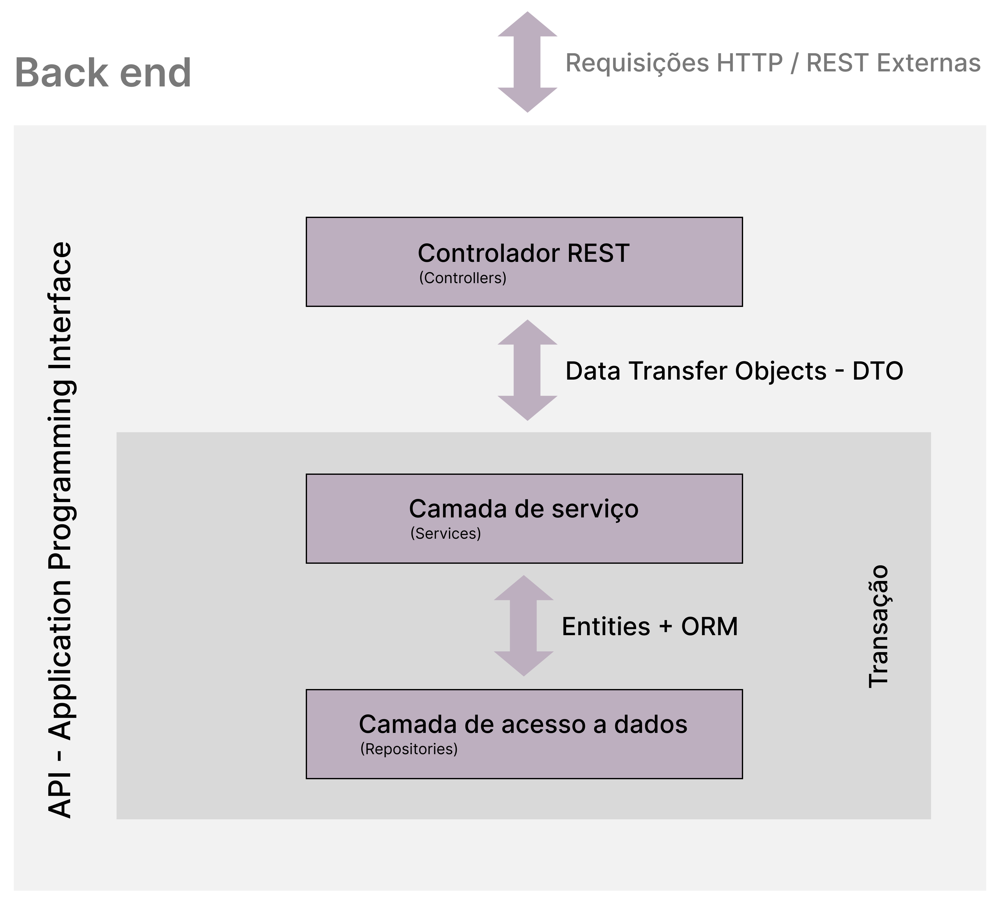
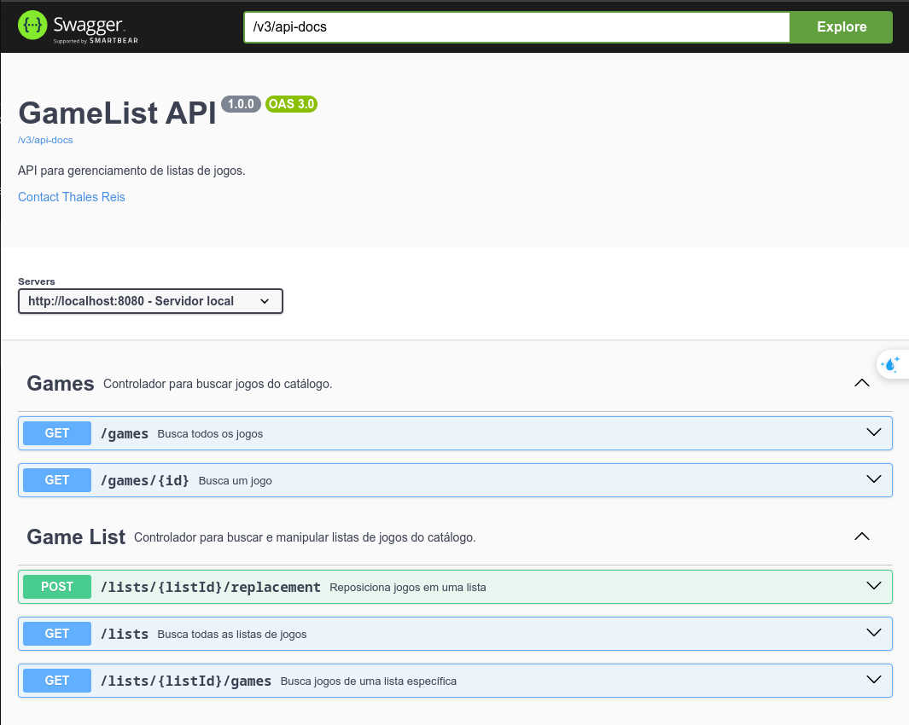

# GameListAPI

Este é um projeto de exemplo contendo uma API REST escrita utilizando linguagem Java 21, framework Spring boot 3, gerenciador de dependências Maven, banco de dados PostgreSQL para o ambiente de desenvolvimento, H2 para o ambiente de teste e a documentação feita com o Swagger através da ferramenta OpenAPI.

Esse projeto, é um projeto didático, de curta duração, com poucos endpoints, e que a princípio, não foi concebido com a intenção de ser utilizado em produção.

## Estrutura do Projeto

O projeto é estruturado de acordo com o padrão de camadas **MVC** - *Model-View-Controller* (Modelo-Visão-Controle) exceto por adequações mínimas para as necessidades do projeto. No entanto, ao observar a estrutura de pacotes e das interações entre as classes, é perceptível a divisão das camadas e as segregações das responsabilidades que cada camada exerce dentro do projeto.



**O projeto contém os seguintes pacotes:**

* **com.dev.gamelist** - contém o arquivo principal do projeto.
* **com.dev.gamelist.config** - contém arquivos de configuração do projeto.
* **com.dev.gamelist.controllers** - contém as classes de controladores REST
* **com.dev.gamelist.dto** - contém as classes que controlam o tráfego de dados entre as camadas do projeto.
* **com.dev.gamelist.entities** - contém as classes que representam o modelo de dados e também são usadas pelo Spring Data JPA para gerar as tabelas do banco de dados.
* **com.dev.gamelist.exceptions** - contém as classes usadas no tratamento de exceções.
* **com.dev.gamelist.projections** - contém classes auxiliares usadas pelo Spring Data JPA na manipulação de consultas SQL nativas.
* **com.dev.gamelist.repositories** - contém as classes de repositórios de acesso a dados.
* **com.dev.gamelist.services** - contém as classes que executam as regras de negócio do projeto.

### Controllers: `GameController`

Esta classe contém os controladores de acesso e manipulação dos dados de títulos de games armazenados na base de dados.

#### Código:

```java
package com.dev.gamelist.controllers;

import java.util.List;

import org.springframework.beans.factory.annotation.Autowired;
import org.springframework.http.HttpStatus;
import org.springframework.http.ResponseEntity;
import org.springframework.web.bind.annotation.GetMapping;
import org.springframework.web.bind.annotation.PathVariable;
import org.springframework.web.bind.annotation.RequestMapping;
import org.springframework.web.bind.annotation.RestController;

import com.dev.gamelist.dto.GameDTO;
import com.dev.gamelist.dto.GameMinDTO;
import com.dev.gamelist.exceptions.ResourceNotFoundException;
import com.dev.gamelist.services.GameService;

import io.swagger.v3.oas.annotations.Operation;
import io.swagger.v3.oas.annotations.Parameter;
import io.swagger.v3.oas.annotations.media.Content;
import io.swagger.v3.oas.annotations.media.Schema;
import io.swagger.v3.oas.annotations.responses.ApiResponse;
import io.swagger.v3.oas.annotations.responses.ApiResponses;
import io.swagger.v3.oas.annotations.tags.Tag;

@RestController
@RequestMapping(value = "/games")
@Tag(name = "Games", description = "Controlador para buscar jogos do catálogo.")
public class GameController {

	@Autowired
	private GameService gameService;

	@Operation(summary = "Busca um jogo", description = "Busca um jogo do catálogo pelo ID do jogo.", parameters = {
			@Parameter(name = "id", description = "ID do jogo", required = true, example = "1") })
	@ApiResponses(value = {
			@ApiResponse(responseCode = "200", description = "A solicitação foi bem-sucedida.", 
					content = @Content(mediaType = "application/json", schema = @Schema(implementation = GameDTO.class))),
			@ApiResponse(responseCode = "400", description = "ID inválido fornecido."),
			@ApiResponse(responseCode = "404", description = "Recurso não encontrado.") })
	@GetMapping(value = "/{id}")
	public ResponseEntity<GameDTO> findById(@PathVariable Long id) {
		if (id == null || id <= 0) {
			return ResponseEntity.badRequest().body(null); // Retorna 400 se o ID for inválido
		}
		try {
			GameDTO game = gameService.findById(id);
			return ResponseEntity.ok(game); // Retorna 200 e o recurso
		} catch (ResourceNotFoundException e) {
			return ResponseEntity.status(HttpStatus.NOT_FOUND).body(null); // Retorna 404 se não for encontrado
		}
	}

	@Operation(summary = "Busca todos os jogos", description = "Retorna todos os jogos de todas as listas do catálogo.")
	@ApiResponses(value = {
			@ApiResponse(responseCode = "200", description = "A solicitação foi bem-sucedida.", 
					content = @Content(mediaType = "application/json", schema = @Schema(implementation = GameMinDTO.class))),
			@ApiResponse(responseCode = "204", description = "Nenhum conteúdo a ser exibido.") })
	@GetMapping
	public ResponseEntity<List<GameMinDTO>> findAll() {
		List<GameMinDTO> games = gameService.findAll();
		if (games.isEmpty()) {
			return ResponseEntity.noContent().build(); // Retorna 204 se não houver dados
		}
		return ResponseEntity.ok(games); // Retorna 200 com a lista
	}
}

```

### Controllers: `GameListController`

Esta classe contém os controladores de acesso e manipulação dos dados das listas de títulos de games armazenados e classificados na base de dados. É nessa classe controller também que se encontra o Endpoint para reordenação e organização dinâmica dos índices de posicionamento dos títulos de games dentro das listas de games.

#### Código:

```java
package com.dev.gamelist.controllers;

import java.util.List;

import org.springframework.beans.factory.annotation.Autowired;
import org.springframework.http.HttpStatus;
import org.springframework.http.ResponseEntity;
import org.springframework.web.bind.annotation.GetMapping;
import org.springframework.web.bind.annotation.PathVariable;
import org.springframework.web.bind.annotation.PostMapping;
import org.springframework.web.bind.annotation.RequestBody;
import org.springframework.web.bind.annotation.RequestMapping;
import org.springframework.web.bind.annotation.RestController;

import com.dev.gamelist.dto.GameListDTO;
import com.dev.gamelist.dto.GameMinDTO;
import com.dev.gamelist.dto.ReplacementDTO;
import com.dev.gamelist.exceptions.ResourceNotFoundException;
import com.dev.gamelist.services.GameListService;
import com.dev.gamelist.services.GameService;

import io.swagger.v3.oas.annotations.Operation;
import io.swagger.v3.oas.annotations.media.Content;
import io.swagger.v3.oas.annotations.media.Schema;
import io.swagger.v3.oas.annotations.responses.ApiResponse;
import io.swagger.v3.oas.annotations.responses.ApiResponses;
import io.swagger.v3.oas.annotations.tags.Tag;

@RestController
@RequestMapping(value = "/lists")
@Tag(name = "Game List", description = "Controlador para buscar e manipular listas de jogos do catálogo.")
public class GameListController {

	@Autowired
	private GameListService gameListService;

	@Autowired
	private GameService gameService;

	@Operation(summary = "Busca todas as listas de jogos", description = "Busca e retorna todas as listas de jogos disponíveis no catálogo.")
	@ApiResponses(value = {
			@ApiResponse(responseCode = "200", description = "Listas de jogos recuperadas com sucesso.", 
					content = @Content(mediaType = "application/json", schema = @Schema(implementation = GameListDTO.class))),
			@ApiResponse(responseCode = "204", description = "Nenhuma lista encontrada.") })
	@GetMapping
	public ResponseEntity<List<GameListDTO>> findAll() {
		List<GameListDTO> gameLists = gameListService.findAll();
		if (gameLists.isEmpty()) {
			return ResponseEntity.noContent().build(); // 204 No Content
		}
		return ResponseEntity.ok(gameLists); // 200 OK
	}

	@Operation(summary = "Busca jogos de uma lista específica", description = "Retorna todos os jogos associados a uma lista específica identificada pelo ID.")
	@ApiResponses(value = {
			@ApiResponse(responseCode = "200", description = "Jogos recuperados com sucesso.", 
					content = @Content(mediaType = "application/json", schema = @Schema(implementation = GameMinDTO.class))),
			@ApiResponse(responseCode = "400", description = "ID inválido fornecido."),
			@ApiResponse(responseCode = "404", description = "Lista não encontrada.") })
	@GetMapping(value = "/{listId}/games")
	public ResponseEntity<List<GameMinDTO>> searchByList(@PathVariable Long listId) {
		if (listId == null || listId <= 0) {
			return ResponseEntity.badRequest().body(null); // 400 Bad Request
		}
		try {
			List<GameMinDTO> games = gameService.findByList(listId);
			if (games.isEmpty()) {
				return ResponseEntity.noContent().build(); // 204 No Content
			}
			return ResponseEntity.ok(games); // 200 OK
		} catch (ResourceNotFoundException e) {
			return ResponseEntity.status(HttpStatus.NOT_FOUND).body(null); // 404 Not Found
		}
	}

	@Operation(summary = "Reposiciona jogos em uma lista", description = "Reposiciona dinamicamente jogos de uma lista com base nos índices fornecidos.")
	@ApiResponses(value = { 
			@ApiResponse(responseCode = "204", description = "Reorganização concluída com sucesso."),
			@ApiResponse(responseCode = "400", description = "ID inválido ou body malformado."),
			@ApiResponse(responseCode = "500", description = "Erro interno durante a reorganização.") })
	@PostMapping(value = "/{listId}/replacement")
	public ResponseEntity<Void> move(@PathVariable Long listId, @RequestBody ReplacementDTO body) {
		if (listId == null || listId <= 0) {
			return ResponseEntity.badRequest().build(); // 400 Bad Request
		}
		if (body == null || body.getSourceIndex() < 0 || body.getDestinationIndex() < 0) {
			return ResponseEntity.badRequest().build(); // 400 Bad Request
		}
		try {
			gameListService.move(listId, body.getSourceIndex(), body.getDestinationIndex());
			return ResponseEntity.noContent().build(); // 204 No Content
		} catch (ResourceNotFoundException e) {
			return ResponseEntity.status(HttpStatus.NOT_FOUND).build(); // 404 Not Found
		} catch (IllegalArgumentException e) {
			return ResponseEntity.badRequest().build(); // 400 Bad Request
		} catch (Exception e) {
			return ResponseEntity.status(HttpStatus.INTERNAL_SERVER_ERROR).build(); // 500 Internal Server Error
		}
	}
}
```

## Funcionalidades

* **Buscar game por ID** : Busca um título de game pelo ID;
* **Retorna todos os games** : Endpoint que retorna uma lista contendo todos os títulos de games.
* **Retorna todas as listas de games** : Endpoint que retorna as lista personalizadas contendo todos os títulos de games pertencentes a uma determinada categoria.
* **Retorna todos os games de uma lista** : Endpoint que retorna uma lista contendo todos os títulos de games de uma determinada lista.
* **Reorganiza os games nas listas** : Endpoint que reorganiza a lista de games mudando a posição de cada título na lista de acordo com uma posição inicial e uma posição final fornecida pela camada de View. Esse endpoint serve para implementar o recurso arrastar e soltar no frontend (camada de View)

## Documentação da API

A documentação em tempo de execução foi feita utilizando Swagger e OpenAPI, e pode ser acessada em tempo de execução através da URL: *http://localhost:8080/swagger-ui.html*



## Executando o Projeto

**Instalar Dependências** : Certifique-se de ter as bibliotecas necessárias instaladas. (Arquivo *pom.xml* disponível para consulta abaixo)

### Dependências: `pom.xml`

No arquivo pom.xml é possível encontrar a estrutura de dependências utilizadas pelo gerenciador de dependências Maven e pode servir de guia para quem deseja utilizar o código desse projeto.

#### Código:

```xml
<?xml version="1.0" encoding="UTF-8"?>
<project xmlns="http://maven.apache.org/POM/4.0.0" xmlns:xsi="http://www.w3.org/2001/XMLSchema-instance"
	xsi:schemaLocation="http://maven.apache.org/POM/4.0.0 https://maven.apache.org/xsd/maven-4.0.0.xsd">
	<modelVersion>4.0.0</modelVersion>
	<parent>
		<groupId>org.springframework.boot</groupId>
		<artifactId>spring-boot-starter-parent</artifactId>
		<version>3.3.5</version>
		<relativePath/> <!-- lookup parent from repository -->
	</parent>
	<groupId>com.dev</groupId>
	<artifactId>gamelist</artifactId>
	<version>0.0.1-SNAPSHOT</version>
	<name>gamelist</name>
	<description>Aula de Java e Spring Boot</description>
	<url/>
	<licenses>
		<license/>
	</licenses>
	<developers>
		<developer/>
	</developers>
	<scm>
		<connection/>
		<developerConnection/>
		<tag/>
		<url/>
	</scm>
	<properties>
		<java.version>21</java.version>
	</properties>
	<dependencies>
		<dependency>
			<groupId>org.springframework.boot</groupId>
			<artifactId>spring-boot-starter-data-jpa</artifactId>
		</dependency>
		<dependency>
			<groupId>org.springframework.boot</groupId>
			<artifactId>spring-boot-starter-web</artifactId>
		</dependency>

		<dependency>
			<groupId>com.h2database</groupId>
			<artifactId>h2</artifactId>
			<scope>runtime</scope>
		</dependency>
		<dependency>
			<groupId>org.postgresql</groupId>
			<artifactId>postgresql</artifactId>
			<scope>runtime</scope>
		</dependency>

		<dependency>
			<groupId>org.springdoc</groupId>
			<artifactId>springdoc-openapi-starter-webmvc-ui</artifactId>
			<version>2.6.0</version>
		</dependency>

		<dependency>
			<groupId>org.springframework.boot</groupId>
			<artifactId>spring-boot-starter-test</artifactId>
			<scope>test</scope>
		</dependency>
	</dependencies>

	<build>
		<plugins>
			<plugin>
				<groupId>org.apache.maven.plugins</groupId>
				<artifactId>maven-resources-plugin</artifactId>
				<version>3.1.0</version> <!--$NO-MVN-MAN-VER$ -->
			</plugin>
			<plugin>
				<groupId>org.springframework.boot</groupId>
				<artifactId>spring-boot-maven-plugin</artifactId>
			</plugin>
		</plugins>
	</build>
</project>
```

#### Dependências e Versões Necessárias

Os softwares e bibliotecas utilizados no projeto tinham a seguintes versões:

* Java - Versão: 21.0.5
* Spring boot - Versão: 3.3.5
* Maven - Versão: 3.8.7
* OpenAPI - Versão: 2.6.0

**Links relacionados:**

* [Debian Linux](https://www.debian.org/index.pt.html)
* [STS4](https://spring.io/tools)
* [Maven](https://maven.apache.org)
* [Swagger](https://swagger.io)
* [Eclipse](https://eclipseide.org)
* [H2](https://www.h2database.com/html/main.html)
* [PostgresSQL](https://www.postgresql.org/)
* [Postman](https://www.postman.com/)
* [DBeaver](https://dbeaver.io/)
* [Git](https://git-scm.com/)

### Arquivos de configuração: `.properties`

No arquivo **.properties** é possível encontrar as configurações padrão de conexões com as bases de dados. Profiles ativos, cors, etc. Esses arquivos podem ser utilizados também no formato .yaml desde feitas as mudanças para obedecer a sintaxe do formato do arquivo.

#### application.properties:

```markdown
spring.application.name=gamelist
spring.profiles.active=${APP_PROFILE:test}
spring.jpa.open-in-view=false

cors.origins=${CORS_ORIGINS:http://localhost:5173,http://localhost:3000}
```

#### application-test.properties:

```markdown
# H2 Connection
spring.datasource.url=jdbc:h2:mem:testdb
spring.datasource.username=sa
spring.datasource.password=

# H2 Client
spring.h2.console.enabled=true
spring.h2.console.path=/h2-console

# Show SQL
spring.jpa.show-sql=true
spring.jpa.properties.hibernate.format_sql=true
```

#### application-dev.properties:

```markdown
#spring.jpa.properties.jakarta.persistence.schema-generation.create-source=metadata
#spring.jpa.properties.jakarta.persistence.schema-generation.scripts.action=create
#spring.jpa.properties.jakarta.persistence.schema-generation.scripts.create-target=create.sql
#spring.jpa.properties.hibernate.hbm2ddl.delimiter=;

spring.datasource.url=jdbc:postgresql://localhost:5433/mydatabase
spring.datasource.username=gamer
spring.datasource.password=1234567

spring.jpa.database-platform=org.hibernate.dialect.PostgreSQLDialect
spring.jpa.properties.hibernate.jdbc.lob.non_contextual_creation=true
spring.jpa.hibernate.ddl-auto=none
```

### Container Docker: `docker-compose.yml`

No arquivo **docker-compose.yml** é possível encontrar um código simples para inicializar um container Docker com a versão mais recente do PostgreSQL que será usado quando o perfil **DEV** estiver ativado. Nesse arquivo não está incluso o container do pgAdmin, já que nesse projeto foi utilizado o DBeaver como manipulador de scripts SQL.

```yml
version: '3.8'

services:
  postgres:
    image: postgres:latest
    container_name: dev-postgresql
    environment:
      POSTGRES_DB: mydatabase
      POSTGRES_USER: gamer
      POSTGRES_PASSWORD: 1234567
    ports:
      - "5433:5432"
    volumes:
      - ./data:/var/lib/postgresql/data
```

## Problemas enfrentados

O código poderá enfrentar problemas ao ser executado utilizando versões diferentes de linguagem e bibliotecas. Certifique-se de que as versões listadas no item "Dependências e Versões Necessárias" estão corretamente instaladas.

## Contribuição

Contribuições são bem-vindas! Sinta-se à vontade para abrir issues e pull requests no repositório do projeto.

## Licença

Este projeto está licenciado sob a Licença MIT - veja o arquivo [LICENSE](https://github.com/thaleswillreis/GameListAPI/blob/main/LICEN%C3%87A_PT-BR.md) para mais detalhes.
