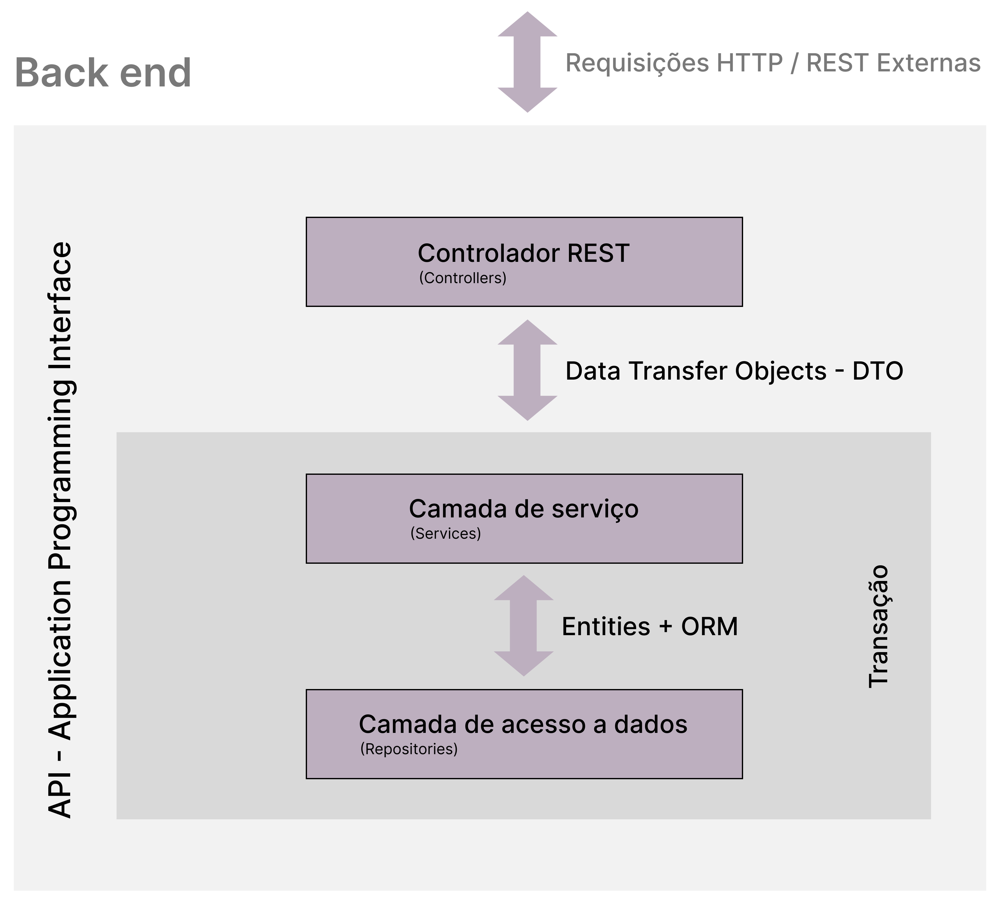

# GameListAPI

This is a sample project containing a REST API written using Java 21, Spring Boot 3 framework, Maven dependency manager, PostgreSQL database for the development environment, H2 for the test environment and documentation created with Swagger through the OpenAPI tool.

This project is a short-term educational project with few endpoints and was not initially designed with the intention of being used in production.

## Project Structure

The project is structured according to the **MVC** - *Model-View-Controller* layer pattern, except for minimal adjustments to the project's needs. However, when observing the package structure and the interactions between classes, the division of layers and the segregation of responsibilities that each layer exercises within the project are noticeable.



**The project contains the following packages:**

* **com.dev.gamelist** - contains the main project file.
* **com.dev.gamelist.config** - contains project configuration files.
* **com.dev.gamelist.controllers** - contains REST controller classes
* **com.dev.gamelist.dto** - contains classes that control data traffic between project layers.
* **com.dev.gamelist.entities** - contains classes that represent the data model and are also used by Spring Data JPA to generate database tables.
* **com.dev.gamelist.exceptions** - contains classes used to handle exceptions.
* **com.dev.gamelist.projections** - contains auxiliary classes used by Spring Data JPA to handle native SQL queries.
* **com.dev.gamelist.repositories** - contains data access repository classes.
* **com.dev.gamelist.services** - contains classes that execute the project's business rules.

### Controllers: `GameController`

This class contains the controllers for accessing and manipulating game title data stored in the database.

#### Code:

```java
package com.dev.gamelist.controllers;

import java.util.List;

import org.springframework.beans.factory.annotation.Autowired;
import org.springframework.http.HttpStatus;
import org.springframework.http.ResponseEntity;
import org.springframework.web.bind.annotation.GetMapping;
import org.springframework.web.bind.annotation.PathVariable;
import org.springframework.web.bind.annotation.RequestMapping;
import org.springframework.web.bind.annotation.RestController;

import com.dev.gamelist.dto.GameDTO;
import com.dev.gamelist.dto.GameMinDTO;
import com.dev.gamelist.exceptions.ResourceNotFoundException;
import com.dev.gamelist.services.GameService;

import io.swagger.v3.oas.annotations.Operation;
import io.swagger.v3.oas.annotations.Parameter;
import io.swagger.v3.oas.annotations.media.Content;
import io.swagger.v3.oas.annotations.media.Schema;
import io.swagger.v3.oas.annotations.responses.ApiResponse;
import io.swagger.v3.oas.annotations.responses.ApiResponses;
import io.swagger.v3.oas.annotations.tags.Tag;

@RestController
@RequestMapping(value = "/games")
@Tag(name = "Games", description = "Controlador para buscar jogos do catálogo.")
public class GameController {

	@Autowired
	private GameService gameService;

	@Operation(summary = "Busca um jogo", description = "Busca um jogo do catálogo pelo ID do jogo.", parameters = {
			@Parameter(name = "id", description = "ID do jogo", required = true, example = "1") })
	@ApiResponses(value = {
			@ApiResponse(responseCode = "200", description = "A solicitação foi bem-sucedida.", 
					content = @Content(mediaType = "application/json", schema = @Schema(implementation = GameDTO.class))),
			@ApiResponse(responseCode = "400", description = "ID inválido fornecido."),
			@ApiResponse(responseCode = "404", description = "Recurso não encontrado.") })
	@GetMapping(value = "/{id}")
	public ResponseEntity<GameDTO> findById(@PathVariable Long id) {
		if (id == null || id <= 0) {
			return ResponseEntity.badRequest().body(null); // Retorna 400 se o ID for inválido
		}
		try {
			GameDTO game = gameService.findById(id);
			return ResponseEntity.ok(game); // Retorna 200 e o recurso
		} catch (ResourceNotFoundException e) {
			return ResponseEntity.status(HttpStatus.NOT_FOUND).body(null); // Retorna 404 se não for encontrado
		}
	}

	@Operation(summary = "Busca todos os jogos", description = "Retorna todos os jogos de todas as listas do catálogo.")
	@ApiResponses(value = {
			@ApiResponse(responseCode = "200", description = "A solicitação foi bem-sucedida.", 
					content = @Content(mediaType = "application/json", schema = @Schema(implementation = GameMinDTO.class))),
			@ApiResponse(responseCode = "204", description = "Nenhum conteúdo a ser exibido.") })
	@GetMapping
	public ResponseEntity<List<GameMinDTO>> findAll() {
		List<GameMinDTO> games = gameService.findAll();
		if (games.isEmpty()) {
			return ResponseEntity.noContent().build(); // Retorna 204 se não houver dados
		}
		return ResponseEntity.ok(games); // Retorna 200 com a lista
	}
}

```

### Controllers: `GameListController`

This class contains the controllers for accessing and manipulating the data from the lists of game titles stored and classified in the database. This controller class also contains the Endpoint for dynamically reordering and organizing the positioning indexes of the game titles within the game lists.

#### Code:

```java
package com.dev.gamelist.controllers;

import java.util.List;

import org.springframework.beans.factory.annotation.Autowired;
import org.springframework.http.HttpStatus;
import org.springframework.http.ResponseEntity;
import org.springframework.web.bind.annotation.GetMapping;
import org.springframework.web.bind.annotation.PathVariable;
import org.springframework.web.bind.annotation.PostMapping;
import org.springframework.web.bind.annotation.RequestBody;
import org.springframework.web.bind.annotation.RequestMapping;
import org.springframework.web.bind.annotation.RestController;

import com.dev.gamelist.dto.GameListDTO;
import com.dev.gamelist.dto.GameMinDTO;
import com.dev.gamelist.dto.ReplacementDTO;
import com.dev.gamelist.exceptions.ResourceNotFoundException;
import com.dev.gamelist.services.GameListService;
import com.dev.gamelist.services.GameService;

import io.swagger.v3.oas.annotations.Operation;
import io.swagger.v3.oas.annotations.media.Content;
import io.swagger.v3.oas.annotations.media.Schema;
import io.swagger.v3.oas.annotations.responses.ApiResponse;
import io.swagger.v3.oas.annotations.responses.ApiResponses;
import io.swagger.v3.oas.annotations.tags.Tag;

@RestController
@RequestMapping(value = "/lists")
@Tag(name = "Game List", description = "Controlador para buscar e manipular listas de jogos do catálogo.")
public class GameListController {

	@Autowired
	private GameListService gameListService;

	@Autowired
	private GameService gameService;

	@Operation(summary = "Busca todas as listas de jogos", description = "Busca e retorna todas as listas de jogos disponíveis no catálogo.")
	@ApiResponses(value = {
			@ApiResponse(responseCode = "200", description = "Listas de jogos recuperadas com sucesso.", 
					content = @Content(mediaType = "application/json", schema = @Schema(implementation = GameListDTO.class))),
			@ApiResponse(responseCode = "204", description = "Nenhuma lista encontrada.") })
	@GetMapping
	public ResponseEntity<List<GameListDTO>> findAll() {
		List<GameListDTO> gameLists = gameListService.findAll();
		if (gameLists.isEmpty()) {
			return ResponseEntity.noContent().build(); // 204 No Content
		}
		return ResponseEntity.ok(gameLists); // 200 OK
	}

	@Operation(summary = "Busca jogos de uma lista específica", description = "Retorna todos os jogos associados a uma lista específica identificada pelo ID.")
	@ApiResponses(value = {
			@ApiResponse(responseCode = "200", description = "Jogos recuperados com sucesso.", 
					content = @Content(mediaType = "application/json", schema = @Schema(implementation = GameMinDTO.class))),
			@ApiResponse(responseCode = "400", description = "ID inválido fornecido."),
			@ApiResponse(responseCode = "404", description = "Lista não encontrada.") })
	@GetMapping(value = "/{listId}/games")
	public ResponseEntity<List<GameMinDTO>> searchByList(@PathVariable Long listId) {
		if (listId == null || listId <= 0) {
			return ResponseEntity.badRequest().body(null); // 400 Bad Request
		}
		try {
			List<GameMinDTO> games = gameService.findByList(listId);
			if (games.isEmpty()) {
				return ResponseEntity.noContent().build(); // 204 No Content
			}
			return ResponseEntity.ok(games); // 200 OK
		} catch (ResourceNotFoundException e) {
			return ResponseEntity.status(HttpStatus.NOT_FOUND).body(null); // 404 Not Found
		}
	}

	@Operation(summary = "Reposiciona jogos em uma lista", description = "Reposiciona dinamicamente jogos de uma lista com base nos índices fornecidos.")
	@ApiResponses(value = { 
			@ApiResponse(responseCode = "204", description = "Reorganização concluída com sucesso."),
			@ApiResponse(responseCode = "400", description = "ID inválido ou body malformado."),
			@ApiResponse(responseCode = "500", description = "Erro interno durante a reorganização.") })
	@PostMapping(value = "/{listId}/replacement")
	public ResponseEntity<Void> move(@PathVariable Long listId, @RequestBody ReplacementDTO body) {
		if (listId == null || listId <= 0) {
			return ResponseEntity.badRequest().build(); // 400 Bad Request
		}
		if (body == null || body.getSourceIndex() < 0 || body.getDestinationIndex() < 0) {
			return ResponseEntity.badRequest().build(); // 400 Bad Request
		}
		try {
			gameListService.move(listId, body.getSourceIndex(), body.getDestinationIndex());
			return ResponseEntity.noContent().build(); // 204 No Content
		} catch (ResourceNotFoundException e) {
			return ResponseEntity.status(HttpStatus.NOT_FOUND).build(); // 404 Not Found
		} catch (IllegalArgumentException e) {
			return ResponseEntity.badRequest().build(); // 400 Bad Request
		} catch (Exception e) {
			return ResponseEntity.status(HttpStatus.INTERNAL_SERVER_ERROR).build(); // 500 Internal Server Error
		}
	}
}
```

## Features

* **Search game by ID** : Searches for a game title by ID;
* **Returns all games** : Endpoint that returns a list containing all game titles.
* **Returns all game lists** : Endpoint that returns custom lists containing all game titles belonging to a given category.
* **Returns all games from a list** : Endpoint that returns a list containing all game titles from a given list.
* **Reorders games in lists** : Endpoint that reorders the list of games by changing the position of each title in the list according to a starting position and an ending position provided by the View layer. This endpoint is used to implement the drag and drop feature in the frontend (View layer)

## API Documentation

The runtime documentation was created using Swagger and OpenAPI, and can be accessed at runtime through the URL: *http://localhost:8080/swagger-ui.html*


## Running the Project

**Install Dependencies**: Make sure you have the necessary libraries installed. (The *pom.xml* file is available for consultation below)

### Dependencies: `pom.xml`

The pom.xml file contains the dependency structure used by the Maven dependency manager, which can serve as a guide for anyone who wants to use the code in this project.

#### Code:

```xml
<?xml version="1.0" encoding="UTF-8"?>
<project xmlns="http://maven.apache.org/POM/4.0.0" xmlns:xsi="http://www.w3.org/2001/XMLSchema-instance"
	xsi:schemaLocation="http://maven.apache.org/POM/4.0.0 https://maven.apache.org/xsd/maven-4.0.0.xsd">
	<modelVersion>4.0.0</modelVersion>
	<parent>
		<groupId>org.springframework.boot</groupId>
		<artifactId>spring-boot-starter-parent</artifactId>
		<version>3.3.5</version>
		<relativePath/> <!-- lookup parent from repository -->
	</parent>
	<groupId>com.dev</groupId>
	<artifactId>gamelist</artifactId>
	<version>0.0.1-SNAPSHOT</version>
	<name>gamelist</name>
	<description>Aula de Java e Spring Boot</description>
	<url/>
	<licenses>
		<license/>
	</licenses>
	<developers>
		<developer/>
	</developers>
	<scm>
		<connection/>
		<developerConnection/>
		<tag/>
		<url/>
	</scm>
	<properties>
		<java.version>21</java.version>
	</properties>
	<dependencies>
		<dependency>
			<groupId>org.springframework.boot</groupId>
			<artifactId>spring-boot-starter-data-jpa</artifactId>
		</dependency>
		<dependency>
			<groupId>org.springframework.boot</groupId>
			<artifactId>spring-boot-starter-web</artifactId>
		</dependency>

		<dependency>
			<groupId>com.h2database</groupId>
			<artifactId>h2</artifactId>
			<scope>runtime</scope>
		</dependency>
		<dependency>
			<groupId>org.postgresql</groupId>
			<artifactId>postgresql</artifactId>
			<scope>runtime</scope>
		</dependency>
		
		<dependency>
			<groupId>org.springdoc</groupId>
			<artifactId>springdoc-openapi-starter-webmvc-ui</artifactId>
			<version>2.6.0</version>
		</dependency>

		<dependency>
			<groupId>org.springframework.boot</groupId>
			<artifactId>spring-boot-starter-test</artifactId>
			<scope>test</scope>
		</dependency>
	</dependencies>

	<build>
		<plugins>
			<plugin>
				<groupId>org.apache.maven.plugins</groupId>
				<artifactId>maven-resources-plugin</artifactId>
				<version>3.1.0</version> <!--$NO-MVN-MAN-VER$ -->
			</plugin>
			<plugin>
				<groupId>org.springframework.boot</groupId>
				<artifactId>spring-boot-maven-plugin</artifactId>
			</plugin>
		</plugins>
	</build>
</project>
```

#### Required Dependencies and Versions

The software and libraries used in the project had the following versions:

* Java - Version: 21.0.5
* Spring boot - Version: 3.3.5
* Maven - Version: 3.8.7
* OpenAPI - Version: 2.6.0

**Related links:**

* [Debian Linux](https://www.debian.org/index.pt.html)
* [STS4](https://spring.io/tools)
* [Maven](https://maven.apache.org)
* [Swagger](https://swagger.io)
* [Eclipse](https://eclipseide.org)
* [H2](https://www.h2database.com/html/main.html)
* [PostgresSQL](https://www.postgresql.org/)
* [Postman](https://www.postman.com/)
* [Git](https://git-scm.com/)

### Configuration files: `.properties`

In the **.properties** file you can find the default settings for database connections. Active profiles, cors, etc. These files can also be used in .yaml format as long as changes are made to comply with the file format syntax.

#### application.properties:

```markdown
spring.application.name=gamelist
spring.profiles.active=${APP_PROFILE:test}
spring.jpa.open-in-view=false

cors.origins=${CORS_ORIGINS:http://localhost:5173,http://localhost:3000}
```

#### application-test.properties:

```markdown
# H2 Connection
spring.datasource.url=jdbc:h2:mem:testdb
spring.datasource.username=sa
spring.datasource.password=

# H2 Client
spring.h2.console.enabled=true
spring.h2.console.path=/h2-console

# Show SQL
spring.jpa.show-sql=true
spring.jpa.properties.hibernate.format_sql=true
```

#### application-dev.properties:

```markdown
#spring.jpa.properties.jakarta.persistence.schema-generation.create-source=metadata
#spring.jpa.properties.jakarta.persistence.schema-generation.scripts.action=create
#spring.jpa.properties.jakarta.persistence.schema-generation.scripts.create-target=create.sql
#spring.jpa.properties.hibernate.hbm2ddl.delimiter=;

spring.datasource.url=jdbc:postgresql://localhost:5433/mydatabase
spring.datasource.username=gamer
spring.datasource.password=1234567

spring.jpa.database-platform=org.hibernate.dialect.PostgreSQLDialect
spring.jpa.properties.hibernate.jdbc.lob.non_contextual_creation=true
spring.jpa.hibernate.ddl-auto=none
```

### Docker Container: `docker-compose.yml`

In the **docker-compose.yml** file you can find a simple code to initialize a Docker container with the latest version of PostgreSQL that will be used when the **DEV** profile is activated. This file does not include the pgAdmin container, since this project used DBeaver as the SQL script handler.

```yml
version: '3.8'

services:
  postgres:
    image: postgres:latest
    container_name: dev-postgresql
    environment:
      POSTGRES_DB: mydatabase
      POSTGRES_USER: gamer
      POSTGRES_PASSWORD: 1234567
    ports:
      - "5433:5432"
    volumes:
      - ./data:/var/lib/postgresql/data
```

## Issues encountered

The code may encounter issues when running using different versions of languages ​​and libraries. Make sure that the versions listed in the "Required Dependencies and Versions" item are correctly installed.

## Contribution

Contributions are welcome! Feel free to open issues and pull requests in the project repository.

## License

This project is licensed under the MIT License - see the file [LICENSE](https://github.com/thaleswillreis/GameListAPI/blob/main/LICEN%C3%87A_PT-BR.md) for more details.
